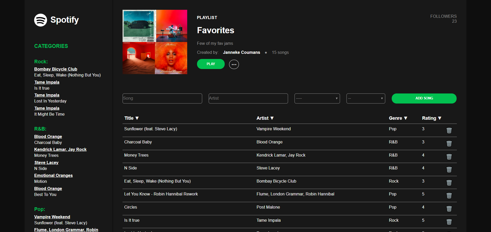

# Project 5 - Playlist

➙ [Bekijk het project](https://jannekecoumans-playlist.netlify.app/)

##  Doel van het project:
Maak een playlist in React, waarbij de gebruiker liedjes kan toevoegen.

--> De gebruiker kan de liedjes sorteren op verschillende manieren en de liedjes uit de lijst verwijderen.

### De gebruiker kan de liedjes sorteren op de volgende manieren:
- Songtitel
- Artiestennaam
- Genre
- Rating
